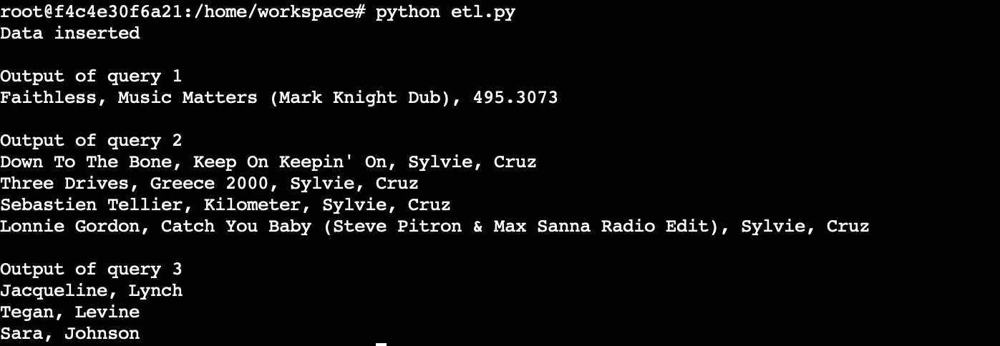

# Sparkify Data Analysis using Cassandra

## Purpose
The purpose of the project is to analyse data stored in various csv files by leveraging Cassandra NoSQL database. Data is modelled based on queries provided. 

## Schema
After analysing the data, it is clear that every entry can be uniquely identified by a combination of userId, sessionId and itemInSession as itemInSession is an incremental value of number of songs a user plays in a session. Hence the **primary key must be a compound key including userId, sessionId and itemInSession** by changing the parition key and clustering keys and adding any other clustering keys if necessary. 

We have 3 tables based on the queries. 

#### Query 1- Give me the artist, song title and song's length in the music app history that was heard during sessionId = 338, and itemInSession = 4
The data is being ordered by sessionId and itemInSession. 

#### Query 2 - Give me only the following: name of artist, song (sorted by itemInSession) and user (first and last name) for userid = 10, sessionid = 182
The data is being queried by userId and SessionId and sorted by itemInSession. Hence, we use itemInSession as a clustering key and it is sorted in ascending order.

#### Query 3 - Give me every user name (first and last) in my music app history who listened to the song 'All Hands Against His Own'
The data is being queried by song name. Hence, we partition by song name and add clustering keys based on above attributes. 

## How to run?
We have 2 python scripts. 

1. **create_tables.py** : Used to create key space, drop tables if they exist and create them. 
2. **etl.py**: Used to extract data from the list, consolidate them into one csv file and then insert the data into tables. This data is queried based on the input. 

## Results

Sample input dataset.

Test queries output. 

